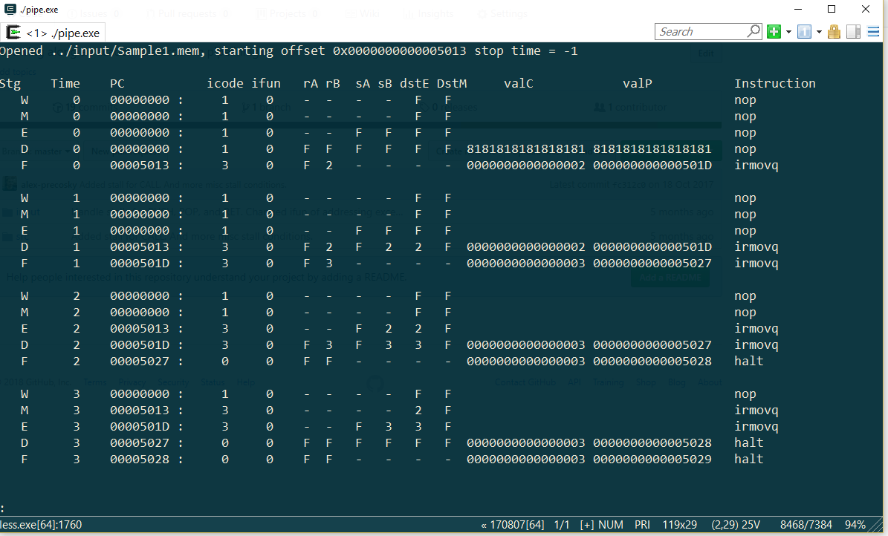

# Y86_64 Pipeline Demo

Simulates the pipeline behaviour of a y86-64 processor, including detection of hazards and stalling.

It does not intend to simulate the entire behaviour of the processor - there is no register file kept track of for example.  For conditional jumps, the jump is always assumed to be taken. This is merely an exercise in pipeline behaviour.

It's been fairly thoroughly tested and I'm not aware of bugs.



# Requirements
 * GNU Make
 * GCC

 This was developed using 64-bit Cygwin on Windows but was tested in 64-bit Debian Linux as well.

 # Building
 Just build the Makefile:
 ```
 $ cd src
 $ make
 ```

 # Running
 Command line syntax:
 ```
 $ ./pipe [y86-64 object code file] (optional start address)
 ```

 For example:
 ```
 $ ./pipe ../input/Sample1.mem 0x5013
 ```
